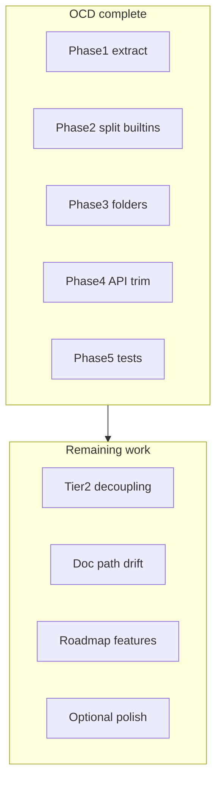

# What remains after the OCD refactor

## OCD plan status: complete

All five phases in [pyrt_ocd_refactor_8556885b.plan.md](.cursor/plans/pyrt_ocd_refactor_8556885b.plan.md) are marked **completed** in plan frontmatter. Validation at last pass:

- `npm run check` — pass
- `npm test` — 116 tests (11 files)
- `npm run golden` — 6 cases

### Success criteria (from the plan)

| Criterion                                                  | Status                                                                                                                                                                                          |
| ---------------------------------------------------------- | ----------------------------------------------------------------------------------------------------------------------------------------------------------------------------------------------- |
| No `src/runtime/` file > ~350 LOC (except registry tables) | Met — largest: `[protocols.ts](src/runtime/dispatch/protocols.ts)` ~321, `[operators/numeric.ts](src/runtime/dispatch/operators/numeric.ts)` ~304, `[slots.ts](src/runtime/core/slots.ts)` ~212 |
| Acyclic layer imports                                      | Met — `core` → no builtins; `dispatch` → core only; etc.                                                                                                                                        |
| Root `[index.ts](src/index.ts)` < 120 lines                | Met — 9 lines (`barrel/stable` + `barrel/advanced`)                                                                                                                                             |
| `protocols.ts` protocol-only (no iterator class defs)      | Met — iterators in `[iterators/](src/runtime/iterators/)`                                                                                                                                       |
| LIVING-PLAN 3-delta                                        | Met — [LIVING-PLAN.md](docs/knowledgebase/LIVING-PLAN.md)                                                                                                                                       |

---

## 1. Tier-2 follow-ups (plan “Optional follow-up”, separate work)

These were **explicitly deferred** in the OCD plan — not missing phases:

1. `**dict-keys` decoupling** — `[collections/dict-keys.ts](src/runtime/collections/dict-keys.ts)` still imports `eq` / `hash` from `[dispatch/operators/index.js](src/runtime/dispatch/operators/index.js)`. Plan suggests using `lookupSpecial` instead to avoid pulling the full operator surface into collections.
2. **Bound-method model** — No `[core/method.ts](src/runtime/core/)` yet; `types.MethodType`-shaped bound methods remain a roadmap/Tier-2 item.
3. `**package.json` export hardening** — `./builtins` subpath exists; plan also mentioned optional `"./internal/*": null` if wildcard deep exports are added later. No `./core` or `./dispatch` **public** subpaths (only `#core/*` / `#dispatch/*` for contributors via `imports`).

---

## 2. Documentation drift (parity, not runtime)

Several docs still describe the **pre-refactor** flat layout. Runtime paths changed; these were only partially updated:

| Doc                                                                                                   | Stale references                                                           |
| ----------------------------------------------------------------------------------------------------- | -------------------------------------------------------------------------- |
| [COMPATIBILITY_AND_GAPS.md](docs/COMPATIBILITY_AND_GAPS.md)                                           | `operators.ts`, `builtins.ts` (many lines; some `builtins/` already fixed) |
| [runtime-overview.md](docs/knowledgebase/10-architecture-runtime/runtime-overview.md)                 | Flat `operators.ts`, old tree                                              |
| [dispatch-and-descriptors.md](docs/knowledgebase/10-architecture-runtime/dispatch-and-descriptors.md) | `operators.ts`                                                             |
| [repo-signals.md](docs/knowledgebase/90-meta/repo-signals.md)                                         | `test/operators.test.ts` → now `test/dispatch/operators.test.ts`           |

**Suggested pass:** one vertical doc sweep mapping old paths → `core/`, `dispatch/operators/`, `builtins/`, `collections/`, `iterators/`.

---

## 3. Optional polish from the OCD plan (low priority)

Not required for “done”; listed in Phase 4/5 as optional:

- `**test/iterators/`** — only if iterator modules grow beyond current two files (`[sequence-iterator.ts](src/runtime/iterators/sequence-iterator.ts)`, `[reversed-iterator.ts](src/runtime/iterators/reversed-iterator.ts)`).
- `**test/golden.test.ts**` — Vitest wrapper that shells `npm run golden` (CI already runs golden via workflow).
- **Folder-level `core/index.ts` barrels** — plan said use only where they reduce noise; only `builtins/index.ts` exists today.
- `**builtins/factory.ts`** — intentionally skipped (plan: avoid mini-framework).

---

## 4. Broader product work (out of OCD scope)

From [LIVING-PLAN.md](docs/knowledgebase/LIVING-PLAN.md) **Next** and the original roadmap — **not** part of the OCD refactor:

- **Golden version matrix** — harness still targets Python 3.14 (3.13 fallback); no 3.9–3.12 matrix for `__match_args__`, buffer, etc.
- **Examples** — async / with / slice not in `examples/python-vs-js.ts` (covered in tests).
- **Tier-3 / roadmap** — VM, import system, new protocols ([roadmap plan](.cursor/plans/pyrt_gaps_and_roadmap_e6884b17.plan.md)); explicitly excluded from OCD.

---

## 5. Consumer / release checklist (if you ship a package)

If you publish or tag a release after this refactor:

- Run `npm run build` and confirm `dist/runtime/builtins/index.js` matches `package.json` `"./builtins"` export.
- Scan downstream imports of **removed** root exports (`dictSet`, `defaultGetAttr`, `attachBufferView`, …) — they are no longer on `[src/index.ts](src/index.ts)`; advanced tier keeps `lookupSpecial`, `prepareNamespace`, etc.

---

## Recommended order if you continue

1. **Doc path sweep** (low risk, high clarity) — ~1 pass over KB + COMPATIBILITY_AND_GAPS.
2. `**dict-keys` decoupling** (small structural win, behavior unchanged).
3. **Golden / version matrix** (behavior validation, separate from layout).
4. **Bound-method model** (feature work, needs its own plan).

No further OCD phases are required unless you want to tighten docs or pursue Tier-2 items above.