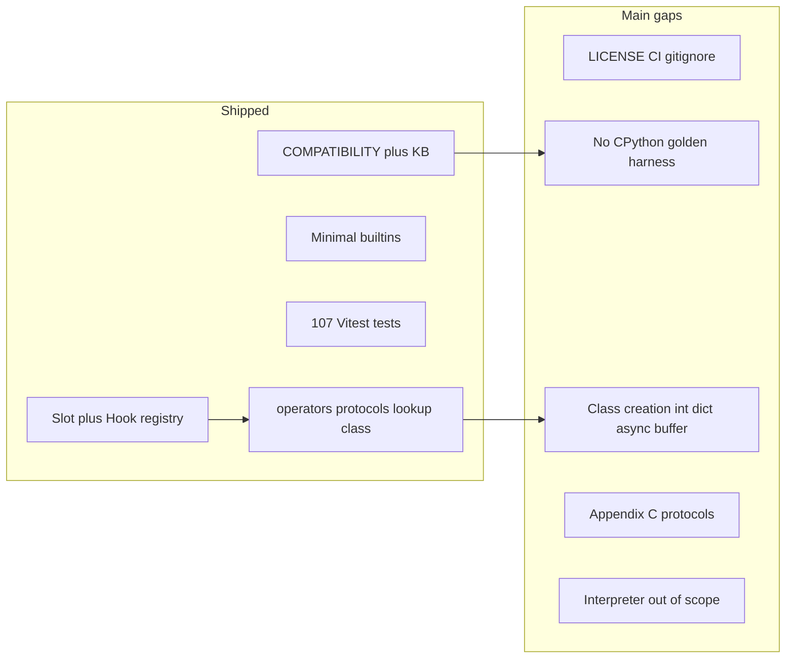
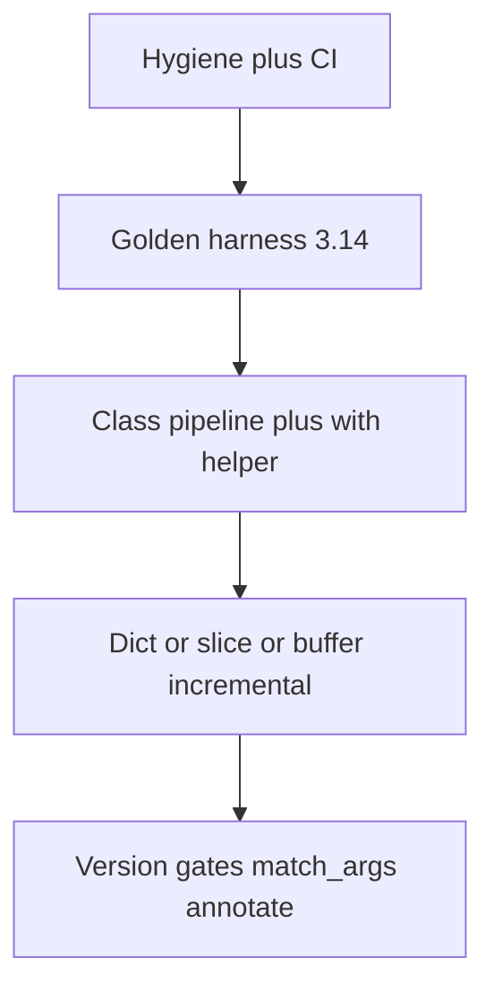

# pyrt: gaps, CPython source signals, and implementation roadmap

## Executive summary

**pyrt already mirrors CPython 3.14’s slot surface:** all **81** dunder names in `slotdefs[]` in [`Objects/typeobject.c`](https://github.com/python/cpython/blob/v3.14.0/Objects/typeobject.c) match [`src/runtime/slots.ts`](src/runtime/slots.ts) (`SLOTDEF_COUNT = 81`). The main gap is not “missing slot names” but **missing or simplified runtime machinery** around those names, plus **large out-of-scope areas** (VM, imports, generators, stdlib).

**Python 3.9–3.14 policy (already in KB):** cite behavior with pinned `https://docs.python.org/3.N/...` URLs; implement slot inventory against **3.14**; do not claim cross-version parity without golden tests ([`docs/knowledgebase/20-domain-theory/python-version-matrix-3.9-3.14.md`](docs/knowledgebase/20-domain-theory/python-version-matrix-3.9-3.14.md)).

---

## What we are missing today

### A. Repository / validation (not product semantics)

| Gap | Evidence | Effort |
|-----|----------|--------|
| No CI | [`docs/knowledgebase/90-meta/repo-signals.md`](docs/knowledgebase/90-meta/repo-signals.md), [`LIVING-PLAN.md`](docs/knowledgebase/LIVING-PLAN.md) | Low |
| No `.gitignore` | Same | Low |
| `LICENSE` file missing (README says MIT) | Same | Low |
| No **golden** tests vs `python3.N` | [`COMPATIBILITY` §12–13](docs/COMPATIBILITY_AND_GAPS.md), validation ladder | Medium |
| `tsx` not in `devDependencies` | Examples use `npx tsx` | Low |
| `node_modules` churn in working tree | Prior `git status` noise | Low (gitignore) |

These are the fastest wins and unblock honest parity claims.

### B. Registry vs dispatch (names exist; behavior incomplete)

From [`COMPATIBILITY` §5–8](docs/COMPATIBILITY_AND_GAPS.md):

| Area | Status | CPython anchor |
|------|--------|----------------|
| **`Slot.__del__`** | Registry only; **no GC/finalization** | Data model §1; not a full `tp_finalize` port in JS |
| **Class creation** | `makeClass` / `instantiate` are a **subset** of `type_new` / `type_call` | [`typeobject.c`](https://github.com/python/cpython/blob/v3.14.0/Objects/typeobject.c) (`type_new`, `type_call`) |
| **`prepareNamespace`** | Exported but **not composed** into default `makeClass` flow like a `class` statement | `Hook.prepare` in [`class.ts`](src/runtime/class.ts) |
| **Metaclass `__call__`** | Commented intent in `instantiate`; not full orchestration | [`Objects/call.c`](https://github.com/python/cpython/blob/v3.14.0/Objects/call.c) (`PyObject_Call`, vectorcall) |
| **`pyInt`** | JS `number`, not arbitrary precision | [`longobject.c`](https://github.com/python/cpython/blob/v3.14.0/Objects/longobject.c) |
| **`pyDict` / `pySet`** | `Map` / `Set`; key **equality/hash** not Python-identical | [`dictobject.c`](https://github.com/python/cpython/blob/v3.14.0/Objects/dictobject.c) |
| **Slicing** | No `slice` type / `__getitem__(slice)` path | [`sliceobject.c`](https://github.com/python/cpython/blob/v3.14.0/Objects/sliceobject.c) |
| **Buffer (PEP 688)** | `getBuffer` / `releaseBuffer` thin wrappers; no PEP 3118 lifecycle | [`memoryobject.c`](https://github.com/python/cpython/blob/v3.14.0/Objects/memoryobject.c), C-API buffer docs |
| **Async** | Protocol helpers return JS `Promise`; no coroutine objects / `asyncio` | [`genobject.c`](https://github.com/python/cpython/blob/v3.14.0/Objects/genobject.c) |
| **`super()` / `__classcell__`** | Not implemented | Compiler + [`cellobject.c`](https://github.com/python/cpython/blob/v3.14.0/Objects/cellobject.c) |
| **Attribute edge cases** | Simplified `__getattribute__` / `__getattr__` | [`object.c`](https://github.com/python/cpython/blob/v3.14.0/Objects/object.c), [`descrobject.c`](https://github.com/python/cpython/blob/v3.14.0/Objects/descrobject.c) |

### C. Not in `Slot`/`Hook` at all ([`COMPATIBILITY` Appendix C](docs/COMPATIBILITY_AND_GAPS.md))

High-signal items pyrt does **not** model as first-class symbols/helpers:

- **Pickle/copy:** `__reduce__`, `__getstate__`, `__copy__`, …
- **Pattern matching:** `__match_args__` (3.10+; **absent** in v3.9.0–3.11 `typeobject.c`, present in ecosystem via class machinery elsewhere)
- **Annotations:** `__annotations__`, `__annotate__` (3.14 LR; **present** in v3.14.0 sources)
- **Introspection metadata:** `__module__`, `__qualname__`, `__doc__` as language-managed fields
- **Coroutine object API:** `send`, `throw`, `close` (beyond `__await__`)
- **`__sizeof__`**, **weakref** protocol
- **`types.MethodType` / bound methods** as CPython models them ([`methodobject.c`](https://github.com/python/cpython/blob/v3.14.0/Objects/methodobject.c) uses **vectorcall**)

### D. Intentionally out of scope ([`COMPATIBILITY` §9–10](docs/COMPATIBILITY_AND_GAPS.md), [`non-goals.md`](docs/knowledgebase/00-intent/non-goals.md))

Do not plan as pyrt features unless product direction changes:

- Parser, bytecode VM ([`Python/bytecodes.c`](https://github.com/python/cpython/blob/v3.14.0/Python/bytecodes.c), [`ceval.c`](https://github.com/python/cpython/blob/v3.14.0/Python/ceval.c))
- `import` / modules / `sys`
- Generators (`yield`), real `asyncio`, `eval`/`exec`
- Full stdlib
- JS operator overloading (withdrawn TC39)

---

## CPython source investigation (`gh` CLI)

**What worked (readonly):**

- `gh api repos/python/cpython` — repo metadata, default branch `main`
- `gh api repos/python/cpython/commits/v3.14.0` — tag resolves (`ebf955df…`)
- `gh api repos/python/cpython/contents/Objects?ref=v3.14.0` — lists core object implementation files
- Complementary raw fetch (when blob API returned 404): `https://raw.githubusercontent.com/python/cpython/v3.14.0/...`

**Useful CPython files for next pyrt work:**

| File | Why it matters |
|------|----------------|
| [`Objects/typeobject.c`](https://github.com/python/cpython/blob/v3.14.0/Objects/typeobject.c) | `slotdefs[]` (81 dunders), `fill_slots`, `type_new`, MRO |
| [`Objects/abstract.c`](https://github.com/python/cpython/blob/v3.14.0/Objects/abstract.c) | `PyNumber_*`, `PyObject_GetItem`, protocol entry points |
| [`Objects/call.c`](https://github.com/python/cpython/blob/v3.14.0/Objects/call.c) | `PyObject_Vectorcall` / calling convention |
| [`Python/bytecodes.c`](https://github.com/python/cpython/blob/v3.14.0/Python/bytecodes.c) | `_PyObject_LookupSpecial` call sites (implicit ops) |
| [`Objects/descrobject.c`](https://github.com/python/cpython/blob/v3.14.0/Objects/descrobject.c) | `__set_name__`, descriptor layout |
| [`Objects/memoryobject.c`](https://github.com/python/cpython/blob/v3.14.0/Objects/memoryobject.c) | Buffer / `__class_getitem__` |
| [`Objects/genobject.c`](https://github.com/python/cpython/blob/v3.14.0/Objects/genobject.c) | Coroutine/generator layout (if ever partial port) |

**Version gate scan (raw `typeobject.c` per tag):**

| Tag | `__buffer__` in tree | `__annotate__` in tree |
|-----|----------------------|-------------------------|
| v3.9.0 | no | no |
| v3.12.0+ | yes | no |
| v3.14.0 | yes | yes |

Aligns with KB matrix: buffer ≥3.12, annotations/PEP 649 ecosystem ≥3.14.

---

## What we could implement (tiered)

### Tier 1 — High value, stays “object model library” (recommended next)

1. **Repo hygiene:** `LICENSE`, `.gitignore`, GitHub Actions (`npm run check` + `npm test`).
2. **Golden harness:** `scripts/golden/` — curated list of `eq`/`add`/`getAttr`/MRO cases run under `python3.14` (expand to 3.9–3.14 only where behavior differs); store expected JSON; fail CI on drift.
3. **Class pipeline depth:** Wire `prepareNamespace` into `makeClass`; optional metaclass `__call__` path mirroring `instantiate` comments in [`class.ts`](src/runtime/class.ts); golden tests against `type(name, bases, ns)`.
4. **`with` helper:** Thin `using`/`withObject(obj, fn)` that calls `enter`/`exit` with correct exception-suppression rules ([`protocols.ts`](src/runtime/protocols.ts)).
5. **Builtin fidelity (incremental):**
   - `pyDict` keys: route lookups through `hash` + `eq` for `PyObject` keys
   - Optional `pyBigInt` or documented “not arbitrary precision” boundary
   - `slice` object + `getItem` integration ([§8.7](docs/COMPATIBILITY_AND_GAPS.md))
6. **Version-gated hooks (document + implement narrowly):**
   - `__match_args__` (3.10+) — tuple layout for pattern matching **consumers**, not full `match` VM
   - `__buffer__` / `__release_buffer__` (3.12+) — minimal exporter object, not full `memoryview`
7. **KB maintenance:** Add [`version-gates-implementation-checklist.md`](docs/knowledgebase/20-domain-theory/) as features land; update `LIVING-PLAN.md` 3-delta.

### Tier 2 — Strong direction, larger design choices

1. **`__annotations__` / `__annotate__` (3.14)** — store deferred annotation callables on `PyType`; no full `typing` runtime.
2. **Pickle/copy protocol** — `Hook` entries + `reduce`/`getstate` helpers for embedders serializing graphs.
3. **`__sizeof__`**, **weakref-like** optional side table (JS `WeakMap` — semantics differ; document `[OPEN]`).
4. **Bound method objects** — model `types.MethodType` (see `methodobject.c`); improves `call` realism.
5. **Vectorcall-shaped fast path** — optional `callVector(obj, args, kwnames)` for performance (not required for correctness).
6. **`Proxy` bridge** — documented adapter mapping `get`/`set` traps to `getAttr`/`setAttr` ([§11](docs/COMPATIBILITY_AND_GAPS.md)).

### Tier 3 — Frontier / usually wrong product for pyrt

- Bytecode interpreter slice, `importlib`, `asyncio`, generators, `super()` with frames, full PEP 3118 memoryviews, structural pattern matching VM.

---

## Suggested priority order (if you approve execution)

1. Hygiene + CI  
2. Golden tests (3.14 first, then matrix spots for 3.9–3.13)  
3. Class creation + context-manager helper  
4. Dict key equality + slice  
5. Buffer + `__match_args__` + annotation storage (scoped)  

---

## Honest answer to “what else is missing?”

| Question | Answer |
|----------|--------|
| Missing slot **names** vs CPython 3.14? | **No** — 81/81 in `slotdefs[]`. |
| Missing **dispatch / semantics**? | **Yes** — see §B and Appendix C. |
| Missing **product infrastructure**? | **Yes** — CI, golden tests, license. |
| Missing **Python the language**? | **By design** — VM, imports, async, generators. |

**Do not edit** [`.cursor/plans/python_runtime_js_94dc0fcc.plan.md`](.cursor/plans/python_runtime_js_94dc0fcc.plan.md); treat [`docs/COMPATIBILITY_AND_GAPS.md`](docs/COMPATIBILITY_AND_GAPS.md) + KB as authority.

---

## Optional follow-up research (if you want deeper CPython diffs)

- `gh api repos/python/cpython/compare/v3.13.0...v3.14.0` (retry with valid tags) for `typeobject.c` / `object.c` churn
- Scripted diff of `slotdefs[]` across `v3.9.0` … `v3.14.0` to populate version-gates checklist automatically
- `gh search code` for `_PyObject_LookupSpecial` in `python/cpython` to build a “implicit opcode → dunder” map for golden test selection
