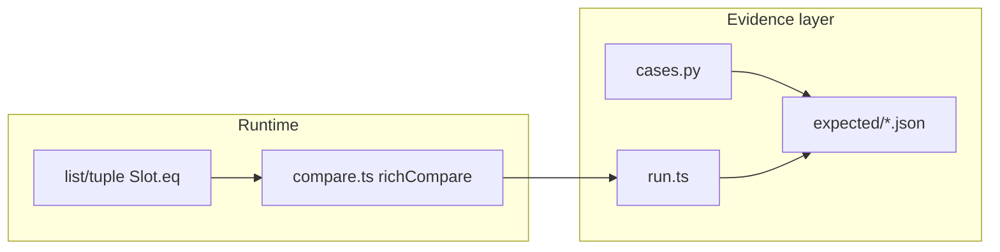

# Tier-1 semantics continuation (LFG)

## Context synthesis


| Source                                                                                        | Finding                                                                                                                        |
| --------------------------------------------------------------------------------------------- | ------------------------------------------------------------------------------------------------------------------------------ |
| [LIVING-PLAN.md](docs/knowledgebase/LIVING-PLAN.md)                                           | Next: more golden `NotImplemented`/rich compare; hash/bool strictness; builtin cross-type delegation                           |
| [parity-gaps-priorities.md](docs/knowledgebase/40-operational-risk/parity-gaps-priorities.md) | Tier-1 #5–8 still open; #5 partially closed by `rich_lt_reflected`                                                             |
| [2026-05-18-tier1-parity-golden-plan.md](docs/plans/2026-05-18-tier1-parity-golden-plan.md)   | **completed** — do not re-implement                                                                                            |
| PR #1                                                                                         | **MERGED** — local `feat/lfg-tier1-parity-evidence` is behind `origin/main` (includes `b1eb67d` golden fixtures for 3.10/3.12) |
| Architecture strategist                                                                       | Highest leverage: `lookupSpecial` + `richCompare`/`binaryOp`; defer `core/lookup` ↔ `class/method` decouple to a later slice   |
| Maintainability                                                                               | List/tuple `__eq__` may mishandle element-level `NotImplemented`; golden fixtures duplicated in `cases.py` + `run.ts`          |


**Branch strategy (user choice):** `git checkout main && git pull` → `git checkout -b feat/tier1-semantics-continuation` (or equivalent name).

---

## Problem frame

Prove and harden remaining **Tier-1 behavioral parity** without expanding scope to metaclass pipeline (`type.__call__`), VM, or import. Align runtime, tests, golden harness, and compatibility docs in one vertical slice.

---

## Requirements

- **R1.** Golden includes a case where **both** operands’ rich-compare path returns `NotImplemented` and CPython raises `TypeError` (ordering op, e.g. `lt` between two custom types with no resolving op).
- **R2.** Golden continues to pass existing cases (`rich_lt_reflected`, `slice_list`, MRO, buffer gates) on CI matrix **3.10 / 3.12 / 3.14**.
- **R3.** List and tuple `__eq__` propagate element comparisons through `eq()` from [compare.ts](src/runtime/dispatch/operators/compare.ts), so nested `NotImplemented` does not become `false`.
- **R4.** Unit tests cover: (a) both-sides `NotImplemented` → `TypeError` for `lt`/`eq` where applicable; (b) `__bool__` non-boolean return → `PyTypeError`; (c) `__hash__` non-number → `PyTypeError`; (d) cross-type `list == int` → `NotImplemented` at builtin boundary then identity/false per `richCompare` rules.
- **R5.** [COMPATIBILITY_AND_GAPS.md](docs/COMPATIBILITY_AND_GAPS.md) and [parity-gaps-priorities.md](docs/knowledgebase/40-operational-risk/parity-gaps-priorities.md) updated for new golden keys and Tier-1 #5–8 status; fix stale line 66 (“CI may run a single Python version”).
- **R6.** [LIVING-PLAN.md](docs/knowledgebase/LIVING-PLAN.md) 3-delta update after implementation.

**Out of scope:** `core/lookup.ts` decouple from `class/method.ts`; full `makeClass`/`type.__call__`; doc path mega-sweep (only touch sections for changed behavior); committing `node_modules/.vite/` artifacts.

---

## Key technical decisions

1. **Golden case `rich_lt_both_not_impl`:** Two minimal classes `IncomparableA` / `IncomparableB` whose `__lt__` (and reflected `__gt__` as needed) return `NotImplemented`; compare instances with `lt(a, b)` in `run.ts` expecting **exception** parity. Mirror in `cases.py` with `try/except TypeError` → JSON boolean or dedicated `"raises": true` field — prefer **same JSON shape as other cases** (e.g. store `"rich_lt_both_not_impl": "TypeError"` or a bool `rich_lt_both_not_impl_raises: true`) to avoid harness special-casing; align with existing [run.ts](scripts/golden/run.ts) compare logic.
2. **Element `eq` fix:** In [list.ts](src/runtime/builtins/list.ts) and [tuple.ts](src/runtime/builtins/tuple.ts) `Slot.eq`, replace direct `typeDict.get(Slot.eq)` calls with `eq(a[i], b[i])` and treat `NotImplemented` as “not equal yet” → return `NotImplemented` from container `__eq__` when any element comparison returns `NotImplemented`.
3. **Hash/bool:** Behavior already strict in [compare.ts](src/runtime/dispatch/operators/compare.ts) (`| 0` on hash; `typeof v !== "boolean"` on bool). Add **Vitest** in [test/dispatch/operators.test.ts](test/dispatch/operators.test.ts); optional golden only if CPython reference is stable across 3.10–3.14.
4. **Golden sync discipline:** Any new class/fixture in `cases.py` must be duplicated in `buildPyrtCases` with matching `golden:`* comment (existing `Rev` pattern).




---

## Implementation units

### U1 — Golden: both sides `NotImplemented`

**Files:** [scripts/golden/cases.py](scripts/golden/cases.py), [scripts/golden/run.ts](scripts/golden/run.ts), regenerate/update [scripts/golden/expected/3.14.json](scripts/golden/expected/3.14.json) and versioned files per [main](origin/main) convention (`3.10.json`, `3.12.json` if present).

**Verification:** `npm run golden` with Python 3.10+ on PATH; CI matrix unchanged.

### U2 — Builtin container `__eq__` delegation

**Files:** [src/runtime/builtins/list.ts](src/runtime/builtins/list.ts), [src/runtime/builtins/tuple.ts](src/runtime/builtins/tuple.ts)

**Tests:** New cases in [test/builtins/list.test.ts](test/builtins/list.test.ts) / tuple tests (or extend existing) — e.g. elements with `__eq__` returning `NotImplemented` should not make `list == list` falsely `false`.

**Verification:** `npm test` targeted then full suite.

### U3 — Unit tests: hash, bool, rich compare edges

**Files:** [test/dispatch/operators.test.ts](test/dispatch/operators.test.ts)

**Scenarios:** non-boolean `__bool__`; non-integer `__hash__`; both-`NotImplemented` ordering; `eq(pyList(...), pyInt(...))` → `false` or `NotImplemented` per CPython (document actual behavior in test name).

**Verification:** `npm run check && npm test`.

### U4 — Documentation sync

**Files:** [docs/COMPATIBILITY_AND_GAPS.md](docs/COMPATIBILITY_AND_GAPS.md) (§8 rich compare / hash / builtins), [parity-gaps-priorities.md](docs/knowledgebase/40-operational-risk/parity-gaps-priorities.md), [LIVING-PLAN.md](docs/knowledgebase/LIVING-PLAN.md)

**Verification:** Manual read — no stale “not golden-tested” for covered cases; CI golden matrix wording correct.

### U5 — (Optional, timeboxed) Golden key parity guard

**Files:** small check in [scripts/golden/run.ts](scripts/golden/run.ts) or `scripts/golden/check-keys.ts` — assert Python JSON keys === pyrt keys before value compare.

**Only if U1–U4 complete with time remaining** (maintainability P3 finding).

---

## LFG pipeline execution (after plan approval)


| Step | Skill / action                                                                                                     | Gate                                                                    |
| ---- | ------------------------------------------------------------------------------------------------------------------ | ----------------------------------------------------------------------- |
| 1    | Write plan to `**docs/plans/2026-05-19-tier1-semantics-continuation-plan.md`** (this content, ce-plan frontmatter) | Plan file exists under `docs/plans/`                                    |
| 2    | `**ce-work**` — U1→U4 on branch from `origin/main`                                                                 | `npm run check`, `npm test`, `npm run golden` green                     |
| 3    | `**ce-code-review mode:autofix plan:docs/plans/2026-05-19-tier1-semantics-continuation-plan.md**`                  | Record residual summary + artifact path                                 |
| 4    | Persist autofixes                                                                                                  | `git commit -m "fix(review): apply autofix feedback"` + push if changes |
| 5    | Residual handoff                                                                                                   | Only if residuals exist — PR body or `docs/residual-review-findings/`   |
| 6    | `**ce-test-browser mode:pipeline**`                                                                                | Skip or note N/A if no web UI (library repo)                            |
| 7    | `**ce-commit-push-pr**`                                                                                            | Open PR with validation checklist                                       |
| 8    | Emit `<promise>DONE</promise>`                                                                                     |                                                                         |


**Pre-flight before step 2:**

```bash
git checkout main && git pull origin main
git checkout -b feat/tier1-semantics-continuation
# ensure Python 3.10+ for golden; do not commit node_modules/.vite/
```

---

## Validation ladder (definition of done)

1. `npm run check`
2. `npm test` (expect ~121+ tests)
3. `npm run golden` (local multi-version optional; CI authoritative on 3.10/3.12/3.14)
4. Docs R5/R6 updated
5. PR description lists commands + Tier-1 items addressed

---

## Risks


| Risk                                                | Mitigation                                                       |
| --------------------------------------------------- | ---------------------------------------------------------------- |
| Golden exception encoding differs by Python version | Use boolean “raises” flag, not exception message string          |
| `eq()` inside list `__eq__` recursion / performance | Only used for `PyObject` elements; keep loop structure           |
| Autofix changes unrelated files                     | Stage only review-fix files in step 4                            |
| Browser test irrelevant                             | Document skip in PR if `ce-test-browser` has nothing to exercise |


---

## Deferred (explicit)

- **Architecture:** decouple [lookup.ts](src/runtime/core/lookup.ts) from [method.ts](src/runtime/class/method.ts) — separate plan
- **Doc path sweep** (stale `operators.ts` in KB) — separate low-risk PR unless bundled minimally in U4
- **lookup decouple / makeClass metaclass** — Tier-1 #4/#9

