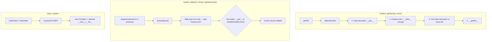

# pyrt

**CPython’s object model in TypeScript** — explicit `PyObject` / `PyType` values, descriptor-aware attribute lookup, and special-method dispatch aligned with [CPython 3.14’s `slotdefs`](https://docs.python.org/3.14/c-api/typeobj.html) inventory (documented against **Python 3.9–3.14**).

This is a **library**, not a Python interpreter. You call functions like `getAttr(obj, "x")`, `add(a, b)`, and `len(obj)` instead of using Python syntax or bytecode.

---

## What this is for

Use **pyrt** when you need Pythonic object semantics inside JavaScript/TypeScript:

- Custom classes with **MRO**, `isinstance`, and metaclass hooks (`makeClass`, `prepareNamespace`)
- **Descriptors** and attribute precedence that mirror `PyObject_GenericGetAttr`
- **Implicit** dunder dispatch (`lookupSpecial`) that mirrors `_PyObject_LookupSpecial` — operators and protocols never read instance `__dict__` for slot names
- Minimal **builtins** (`pyList`, `pyDict`, …) backed by JS structures but routed through the same dispatch layer
- A honest **compatibility matrix** so you know what matches CPython and what does not

Typical embedders: language tooling, teaching runtimes, test doubles for Python APIs, or experiments that need the data model without CPython itself.

---

## What this is not

| Out of scope | Why |
|--------------|-----|
| `import`, bytecode, `exec` / `eval` | No VM |
| `super()`, generators, full `asyncio` | No frames / scheduler |
| `match` / `case` | No pattern-matching VM (`__match_args__` is metadata only) |
| Full stdlib, `property` / `classmethod` helpers | Not shipped in `src/` |
| “Drop-in CPython” | See [parity gaps](#cpython-parity-honesty) below |

Detail: [docs/COMPATIBILITY_AND_GAPS.md](docs/COMPATIBILITY_AND_GAPS.md) · [docs/knowledgebase/00-intent/non-goals.md](docs/knowledgebase/00-intent/non-goals.md)

---

## How we implement it (design)

1. **Two lookup channels** — same split as CPython’s data model docs:
   - **Explicit attributes** (`getAttr` / `setAttr` / `delAttr`) → data descriptor on type → instance `dict` / `__slots__` → non-data descriptor or class attr → `__getattr__` (see `defaultGetAttr` in `src/runtime/core/lookup.ts`)
   - **Implicit specials** (`lookupSpecial`) → type MRO only; binds plain functions as `MethodType`-shaped objects (`bindMethod`)
2. **Explicit operators in JS** — JavaScript has no user-defined `+`; pyrt exports `add`, `eq`, `getItem`, etc. from `src/barrel/stable.ts`
3. **Registry-first** — all CPython 3.14 slot names live in `Slot` + non-slot specials in `Hook` (`src/runtime/core/slots.ts`; see `SLOTDEF_COUNT`); dispatch lives in `dispatch/operators/` and `dispatch/protocols.ts`
4. **Evidence-backed parity** — Vitest unit tests + optional `npm run golden` against installed CPython interpreters (version-gated cases in `scripts/golden/cases.py`). Curated cases from CPython’s `Lib/test` are ported under `test/cpython-derived/`; `vendor/cpython` (submodule, `v3.14.0`) is a **reference** for mining, not a CI test run.
5. **Layered source** — `core` → `dispatch` / `class` / `builtins` / `collections` / `iterators` / `buffer` (no circular imports into builtins from core)

---

## How it works (runtime map)

### Memory layout

| pyrt | CPython analogue |
|------|------------------|
| `PyObject` — `type`, `dict` (`Map`), optional `slotValues[]` | `PyObject` — `ob_type`, `__dict__` or slots |
| `PyType` extends `PyObject` — `name`, `bases`, `mro`, `typeDict` | `PyTypeObject` — MRO, `tp_dict`, type slots |

Bootstrap types: `objectType`, `typeType` (`src/runtime/core/object.ts`).

### Dispatch paths



**Important:** `obj.__add__` via `getAttr` can see the instance dict; `add(obj, other)` uses `lookupSpecial` and **cannot** — matching [special method lookup](https://docs.python.org/3/reference/datamodel.html#special-method-lookup).

### Source layout

```
src/
  index.ts                 # stable + advanced barrels
  barrel/stable.ts         # PyObject, operators, protocols, builtins, class helpers
  barrel/advanced.ts       # lookupSpecial, computeC3, prepareNamespace, bindMethod
  runtime/
    core/                  # object, slots, lookup, errors
    dispatch/              # operators/, protocols.ts, dispatch.ts
    class/                 # makeClass, isinstance, method.ts (bound methods)
    builtins/              # pyNone, pyInt, pyList, pyDict, …
    collections/           # dict-keys (eq/hash for PyObject keys), slice
    iterators/             # sequence / reversed iterators
    buffer/                  # minimal __buffer__ surface
```

Contributor imports: `#core/*`, `#dispatch/*` (see `package.json` `imports`).

### Public API tiers

| Import | Contents |
|--------|----------|
| `import { … } from "pyrt"` | Stable + advanced symbols (both re-exported from `src/index.ts`) |
| `import { … } from "pyrt/builtins"` | Builtin factories only (`package.json` subpath) |

Advanced symbols (`lookupSpecial`, `computeC3`, `prepareNamespace`, `bindMethod`, …) ship on the main entry; there is no separate npm export subpath for them.

---

## CPython parity honesty

Every name in `Slot` / `Hook` is registered in `slots.ts`; **behavior** is only partially aligned with CPython. Recent fixes: `contains` fallback uses `eq()`; list/tuple accept `__getitem__(slice)`; `lookupSpecial` binds descriptors, plain functions, and callable `PyObject`s on the type. Gaps remain (`pyInt` as JS number, `makeClass` vs full `type.__call__`, thin golden coverage) — see the matrix links below.

**Do not** claim “CPython compatible” without citing what you tested (`npm test`, `npm run golden`, and the matrix below).

| Resource | Use for |
|----------|---------|
| [COMPATIBILITY_AND_GAPS.md](docs/COMPATIBILITY_AND_GAPS.md) | Full supported / partial / out-of-scope list |
| [parity-gaps-priorities.md](docs/knowledgebase/40-operational-risk/parity-gaps-priorities.md) | Tier 1–3 fix order |

---

## Quick start

```bash
npm install
npm run check    # tsc --noEmit
npm test         # vitest unit suite
npm run golden   # compare to installed CPython (optional; needs python3.9–3.14 on PATH)
npm run golden:keys  # refresh scripts/golden/expected/key-sets.json after adding case keys
npm run cpython:mine  # list Lib/test modules worth mining (needs submodule init)
npm run build    # emit dist/ for publishing
```

**Example usage:**

```ts
import {
  makeClass,
  objectType,
  PyObject,
  getAttr,
  add,
  eq,
  Slot,
} from "pyrt";

const Vec = makeClass({
  name: "Vec",
  bases: [objectType],
  dict: new Map([
    [Slot.init, (self: PyObject, x: number, y: number) => {
      self.dict.set("x", x);
      self.dict.set("y", y);
    }],
    [Slot.add, (self: PyObject, other: PyObject) => {
      return new PyObject(Vec, /* … */);
    }],
  ]),
});

const a = new PyObject(Vec);
// Explicit attribute access (instance dict + descriptors):
getAttr(a, "x");
// Implicit special method (MRO only, bound method):
add(a, b);
```

Patterns vs raw JS: `npx tsx examples/python-vs-js.ts`

---

## Documentation

| Doc | Purpose |
|-----|---------|
| [Knowledgebase](docs/knowledgebase/README.md) | Layered architecture, version matrix, validation ladder |
| [COMPATIBILITY_AND_GAPS.md](docs/COMPATIBILITY_AND_GAPS.md) | Supported / partial / out-of-scope + CPython source map |
| [Runtime overview](docs/knowledgebase/10-architecture-runtime/runtime-overview.md) | Module layout and dispatch summary |
| [Dispatch & descriptors](docs/knowledgebase/10-architecture-runtime/dispatch-and-descriptors.md) | `getAttr` vs `lookupSpecial` |

---

## Verification

| Command | What it proves |
|---------|----------------|
| `npm test` | Unit behavior (lookup, operators, protocols, class, builtins) |
| `npm run golden` | Selected behaviors vs CPython JSON expectations per installed version (key parity runs before value compare) |
| `npm run golden:keys` | Regenerate committed key snapshot when adding or renaming golden case keys |
| `npm run check` | TypeScript types for public API |

Golden cases (25 keys per Python profile) include MRO, `isinstance`/`issubclass`, rich compare (`rich_lt_reflected`, `rich_lt_both_not_impl_raises`), list slicing, contains, int↔float / int↔bool / bool↔float compare/arithmetic, sequence bool repetition (`seq_bool_mul`, `seq_bool_rmul`), descriptor precedence (`descriptor_data_wins`, `descriptor_nodata_loses`), class hooks (`init_subclass_called`, `set_name_called`), and version-gated `__match_args__` (3.10+), buffer (3.12+), `__annotate__` (3.14+). **New golden cases** must add the same JSON key to both `scripts/golden/cases.py` and `buildPyrtCases` in `scripts/golden/pyrt-cases.ts`; run `npm run golden:keys` when the key set changes.

---

## License

MIT — see [LICENSE](LICENSE).
