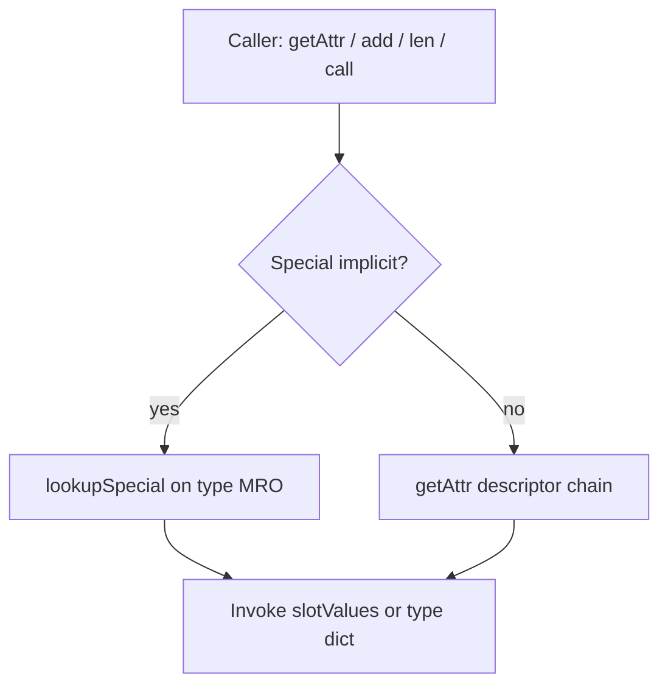

# Runtime overview

`[REPO]` Module layout under `src/runtime/`.

```
src/
  index.ts              # Public exports (barrel/stable + barrel/advanced)
  barrel/               # stable vs advanced re-exports
  runtime/
    core/               # slots, object, errors, lookup
    dispatch/           # dispatch helpers, operators/, protocols
    class/              # makeClass, instantiate, isinstance, …
    builtins/           # pyNone, pyInt, pyStr, … (per-type modules)
    collections/        # dict-keys, slice
    buffer/             # buffer protocol helpers
    iterators/          # sequence / reversed iterators
```

---

## Core types

| Type | Role |
|------|------|
| `PyObject` | Instance: `type`, optional `dict`, `slotValues` for slotted dunders |
| `PyType` | Type object: MRO, `dict`, slot table, `hookHandlers` |
| `NotImplemented` | Sentinel for unresolved binary ops |

Bootstrap: `objectType`, `typeType` — types for `object` and `type`.

---

## Dispatch paths



`[SYNTH]` Special implicit operations (`lookupSpecial`) never read instance `__dict__` for dunder names — matches [OFFICIAL] 3.9–3.14 special lookup.

---

## Slot registry

`[REPO]` `Slot` mirrors CPython 3.14 `slotdefs[]` count (`SLOTDEF_COUNT = 81`). Each slot maps to a dunder string in `SLOT_DUNDER_NAMES`.

Non-slot specials (class creation, `__class_getitem__`, …) live in `Hook`.

---

## Builtins

`[REPO]` Minimal builtin types in `builtins/`:

- `pyNone`, `pyBool`, `pyInt` (JS number), `pyFloat`, `pyStr`
- `pyList`, `pyTuple`, `pyDict` (Map-backed), `pySet` (Set-backed)

Not a full CPython builtins module.

---

## Public API

`[REPO]` Re-exported from `src/index.ts` — operators, protocols, class helpers, types, slot names for introspection.

---

## Tests & examples

| Artifact | Count / note |
|----------|----------------|
| Vitest | 207 tests, 26 files (`test/core/`, `test/dispatch/`, `test/class/`, `test/cpython-derived/`, `test/golden/`, …) |
| Examples | 39 sections in `examples/python-vs-js.ts` |
| Golden | `npm run golden` — CPython JSON parity + key guard (`npm run golden:keys`) |

---

## Python version alignment

- **Reference:** 3.9–3.14 docs (pinned URLs)
- **Slot list anchor:** 3.14
- **Validation:** `npm test`, `npm run check`, `npm run golden` — CI matrix Python 3.10/3.12/3.14

See [../20-domain-theory/python-version-matrix-3.9-3.14.md](../20-domain-theory/python-version-matrix-3.9-3.14.md).
