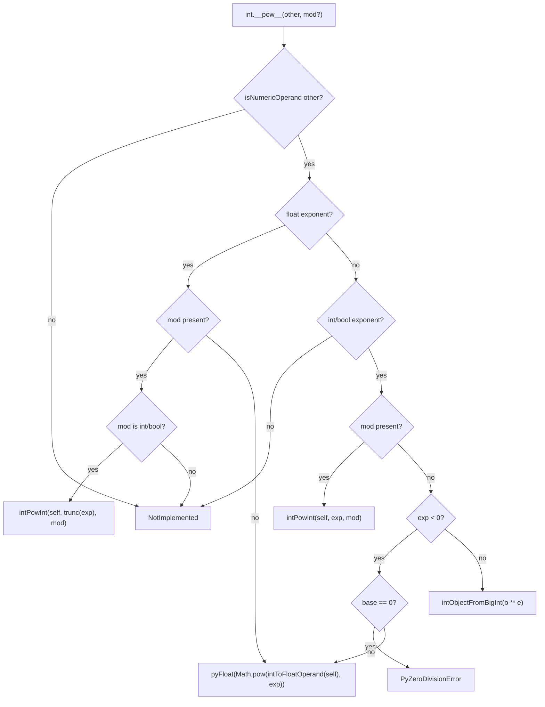

# Bigint int pow

## Summary

Extend bigint-stored `int` objects (plans 915/926/927) with CPython-parity **`**` / `pow()`** against int and bool operands, including three-arg modular exponentiation when base, exponent, and modulus are int/bool. Evidence extends `int-bigint-arithmetic.test.ts` using `float.as_integer_ratio()` components. Next bigint tower operator slice after division (plan 927).

## Problem Frame

Plans 926 and 927 wired bigint-aware compare, add/sub/mul, and `//`/`%`/`divmod`, but `Slot.pow` still read `nativeVal<number>(self)` and used `Math.pow` for two-arg results. Bigint-stored ints from `as_integer_ratio()` therefore mis-exponentiated or silently corrupted. LIVING-PLAN lists pow as the next deferred bigint tower operator.

## Requirements

### Operator parity

- R1. Bigint int `**` / `pow()` int (safe-integer and bigint-stored) in both operand orders where the operation stays int↔int.
- R2. Bigint int `**` / `pow()` bool treats the exponent as 0 or 1 (`False`→0, `True`→1) in both orders where CPython returns an int result.
- R3. When the exponent is a non-integer float, or a negative int exponent would yield a non-integer result, `**` returns `pyFloat` with CPython semantics (same promotion path as safe-int pow today).
- R4. Two-arg results preserve bigint storage when the mathematical result exceeds `MAX_SAFE_INTEGER`.
- R5. Three-arg `pow(base, exp, mod)` with int/bool base, exponent, and modulus uses integer modular exponentiation and preserves bigint storage when the reduced result exceeds safe range.
- R6. Three-arg `pow(..., mod)` with `mod == 0` raises `PyValueError` with message `pow() 3rd argument cannot be 0` (unchanged contract from `operator-pow-mod.test.ts`).

### Evidence and docs

- R7. Extend `test/cpython-derived/int-bigint-arithmetic.test.ts` with CPython-sourced cases for two-arg and at least one three-arg modular case on ratio-derived bigint operands.
- R8. Update `docs/COMPATIBILITY_AND_GAPS.md` §8.15, `docs/knowledgebase/50-execution/validation-ladder.md`, and `docs/knowledgebase/LIVING-PLAN.md` with plan 928 delta.
- R9. `npm run check && npm test` pass.

## Key Technical Decisions

| Decision | Rationale |
|----------|-----------|
| Ship two-arg and three-arg int modular pow together (see origin K1) | `Slot.pow` already exposes a three-arg branch; fixing only two-arg leaves `pow(big, exp, mod)` broken and duplicates work |
| Reuse plan 926/927 bigint operand path: `intNativeValue`, `intOperandFromObject`, `toIntBigInt`, `intObjectFromBigInt` (see origin K2) | Same routing as add/sub/mul and divmod; avoids ad hoc coercion at the slot |
| Add `intPowInt` + `intModPow` helpers | Two-arg uses JS `bigint ** bigint`; three-arg uses binary modular exponentiation with extended-Euclidean inverse for negative exponents |
| Float exponent promotes to float via `intToFloatOperand` + existing float branch (see origin K3) | Matches safe-int `bigint ** float` behavior; bigint base must not read truncated `number` native |
| Defer inplace `**=` (`ipow`) on bigint operands (see origin K4) | Consistent with plan 927 deferring inplace division operators |
| Defer bitwise, shift, str parsing, bigint-self `to_bytes` / `as_integer_ratio` (see origin K5) | Tower sequencing; out of this operator slice |

---

## High-Level Technical Design



Three-arg dispatch in `src/runtime/dispatch/operators/numeric.ts` continues to reject complex operands with `ValueError: complex modulo` before slots run (plan 902). No change to that guard in this slice.

---

## Scope Boundaries

### In scope

- `Slot.pow` bigint-aware paths for int↔int/bool two-arg and three-arg modular exponentiation
- CPython-derived evidence extension and doc sync

### Deferred for later

- Bigint inplace `**=` (`ipow`)
- Bigint bitwise and shift operators on bigint-stored operands
- Arbitrary-precision int literal parsing and bigint-self `to_bytes` / `as_integer_ratio`
- PEP 3118

### Deferred to Follow-Up Work

- Negative-modulus three-arg sign semantics (`pow(den, 2, -7)` CPython `negativeOutput` rule)
- Float exponent with third argument (`pow(2, 2.5, 7)`) — CPython raises; float branch may truncate unless guarded
- Exact CPython invertible-modulus error message text alignment
- JS `Maximum BigInt size exceeded` → `OverflowError` mapping for astronomical exponents

### Outside this slice

- Complex or float modulus in three-arg pow (existing `ValueError: complex modulo` paths unchanged)
- Refactoring all `numericOperand` call sites beyond pow

---

## Acceptance Examples

- AE1. **Covers R1, R4.** Given ratio denominator `den` from `float(0.1).as_integer_ratio()`, when `den ** 2` runs, then the result equals `36028797018963968n ** 2n` as a bigint-stored int.
- AE2. **Covers R2.** Given `den`, when `den ** True` runs, then the result equals `den`; when `den ** False` runs, then the result is `1`.
- AE3. **Covers R5, R6.** Given safe-int base `pyInt(2)`, exponent `pyInt(10)`, modulus `pyInt(1000)`, when three-arg `pow` runs, then the result is `24`. Given any int base and `mod == 0`, when three-arg `pow` runs, then `PyValueError` is raised with the CPython message.
- AE4. **Covers R3.** Given bigint-stored `den`, when `den ** -1` runs, then the result is a `pyFloat` equal to `1 / Number(den)` (CPython non-integer int power).

---

## Implementation Units

### U1. Runtime bigint pow operators

**Goal:** Wire `Slot.pow` to handle `number | bigint` native storage for int↔int/bool two-arg and three-arg modular exponentiation.

**Requirements:** R1–R6

**Dependencies:** Plans 915/926/927 helpers merged on `main`.

**Files:** `src/runtime/builtins/int.ts`

**Approach:** Add `intModPow` (binary modular exponentiation + `intModInverse` for negative exponents) and `intPowInt` (routes two-arg vs three-arg, mod-zero guard before math). Update `Slot.pow` to read `intNativeValue(self)`, resolve int/bool exponent and modulus via `intOperandFromObject`, and delegate to `intPowInt`. Preserve float-exponent branch with `intToFloatOperand` for bigint bases. Return via `intObjectFromBigInt` — do not wrap bigint results in `Number(...)`.

**Patterns to follow:** Plan 927 slot routing in `floordiv`/`mod`/`divmod`; plan 052 mod-zero guard before `BigInt` math.

**Test scenarios:**

- Happy path: `den ** 2` → bigint-stored square; `den ** True` → `den`; `den ** False` → `1`
- Covers AE1, AE2. `num ** 3` when result exceeds safe range stays bigint-stored
- Three-arg: `pow(den, 2, 7)` → small int residue; `pow(2, 10, 1000)` → `24` (covers AE3 safe-int case)
- Covers AE4. `den ** -1` → `pyFloat` close to CPython double
- Error path: `pow(2, 3, 0)` → `PyValueError` with mod-zero message (covers AE3); `0 ** -1` → `PyZeroDivisionError`
- Edge: `pow(den, 2, num)` with ratio-derived bigint modulus operand
- Integration: builtin `pow()` ternary dispatch reaches updated slot; `operator-pow-mod.test.ts` remains green

**Verification:** U2 evidence tests pass.

### U2. Evidence and docs

**Goal:** Lock parity with CPython-derived cases and sync documentation.

**Requirements:** R7–R9

**Dependencies:** U1

**Files:** `test/cpython-derived/int-bigint-arithmetic.test.ts`, `docs/COMPATIBILITY_AND_GAPS.md`, `docs/knowledgebase/50-execution/validation-ladder.md`, `docs/knowledgebase/LIVING-PLAN.md`

**Approach:** Extend existing bigint evidence file (canonical home per plans 926/927); add pow cases for ratio `den`/`num`, bool exponent, negative exponent float promotion, and at least one three-arg modular case. Update §8.15 bigint tower bullet to include `**`/`pow`. Add LIVING-PLAN delta marking pow landed; remove pow from deferred tower list.

**Test scenarios:**

- Covers AE1–AE4 via ratio-derived operands and assertions on unwrap/repr/type
- Regression: `operator-pow-mod.test.ts` mod-zero and two-arg safe-int cases unchanged
- Optional follow-up cases (not blocking ship): `True ** den`, `pow(2, 3, True)`, `pow(0, 0, 5)`

**Verification:**

```bash
npm run check && npm test
```

---

## Risks and Dependencies

| Risk | Mitigation |
|------|------------|
| Negative-modulus three-arg sign differs from CPython | Document in COMPATIBILITY or fix in follow-up; ratio evidence uses positive moduli |
| Float exponent + mod silently truncates | Guard in `Slot.pow` when `mod` present and exponent is float; defer if out of slice |
| JS bigint exponent size limits | Accept JS engine errors for astronomical `2 ** huge`; note in COMPATIBILITY |
| `intToFloatOperand` precision on negative exponent | Ratio `den ** -1` passes today; add evidence assertion with tolerance |

**Prerequisites:** Plans 915, 917, 926, 927 merged on `main`.

---

## Open Questions

- Whether to add dedicated negative-exponent regression beyond AE4 in the evidence file — **default:** AE4 plus `0 ** -1` zero-base case is sufficient for this slice.
- Whether three-arg modular cases need a bigint modulus operand test — **default:** yes, include `pow(den, 2, num)` or equivalent ratio-derived modulus.

---

## Sources and Research

- `docs/brainstorms/2026-06-13-bigint-int-pow-requirements.md` — origin requirements and acceptance examples
- `docs/plans/2026-06-13-001-feat-bigint-int-comparison-arithmetic-plan.md` — plan 926 pattern
- `docs/plans/2026-06-13-002-feat-bigint-int-divmod-floordiv-mod-plan.md` — plan 927 pattern and deferrals
- `docs/plans/2026-05-24-052-fix-pow-mod-zero-plan.md` — mod-zero guard contract
- `src/runtime/builtins/int.ts` — `Slot.pow`, `intPowInt`, `intModPow`
- `test/cpython-derived/int-bigint-arithmetic.test.ts` — evidence home
- `test/cpython-derived/operator-pow-mod.test.ts` — safe-int three-arg contract
- Local repo research; external research skipped (926/927 patterns sufficient)

---

## Verification

```bash
npm run check && npm test
```
